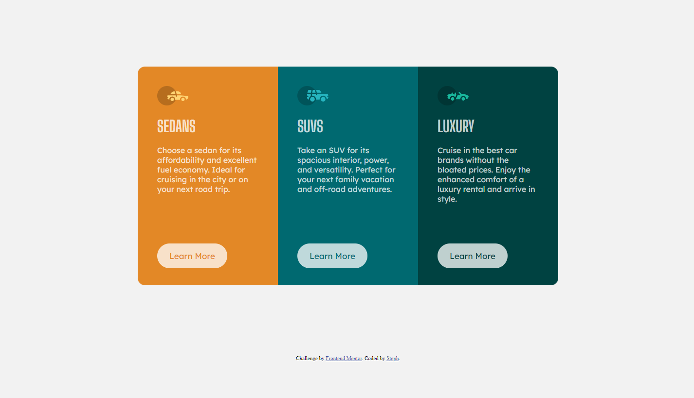

# Steph - 3-column preview card component

This is a solution to the [3-column preview card component on Frontend Mentor](https://www.frontendmentor.io/challenges/3column-preview-card-component-pH92eAR2-). 

## Overview

### Screenshot

You can check it out live [here](https://xstephx.github.io/3-column-preview-card-component-challenge/).

## My process

### Built with

- HTML custom properties
- CSS custom properties
- CSS Grid
- CSS Media Queries

# 🚀🚀🚀

